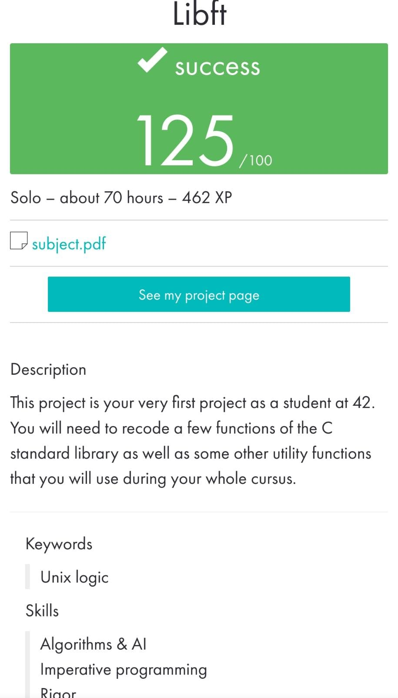

# libft

_____________________________________
 Cursus | 42 Málaga
 
   l   i   b   f   t
_____________________________________

This project is about coding a C library.
It contains a lot of general purpose functions our programs will rely upon.
C programming can be very tedious when one doesn’t have access to the highly useful
standard functions. This project is about understanding the way these functions work,
implementing and learning to use them. we create our own library. It will be
helpful since we use it in our next C school assignments.

Oct 2022

  

